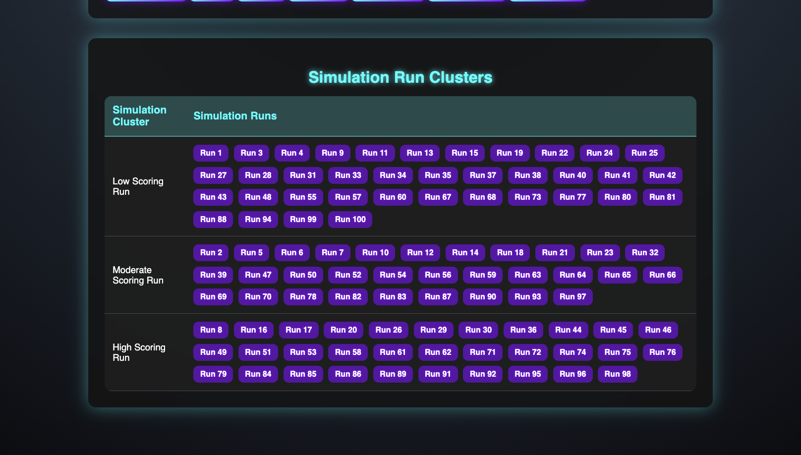

---
# 📌 Fullstack Cricket Simulation Dashboard 🏏

A **full-stack** web application that simulates cricket matches and provides interactive visualizations along with advanced ML analytics on simulation data for each selected game. The app uses a FastAPI backend and a React frontend with a sleek, neon-themed UI.
---
## 🔑 Login Details

To access the **Cricket Simulation Dashboard**, use the following test credentials:

- **Username**: `test`
- **Password**: `test`

> ⚠️ *These are test credentials and should not be used in production.*

## 📌 **Features**

✅ **Simulated Cricket Matches**
&nbsp;&nbsp;&nbsp;&nbsp;Uses predefined CSV data to simulate cricket results.

📊 **Interactive Charts**
&nbsp;&nbsp;&nbsp;&nbsp;Visual representation of simulation runs with Chart.js.

🎯 **Game Filtering**
&nbsp;&nbsp;&nbsp;&nbsp;Filter matches based on date, venue, and teams.

🎨 **Modern UI**
&nbsp;&nbsp;&nbsp;&nbsp;Tailwind CSS for a sleek, neon-themed look.

⚡ **REST API**
&nbsp;&nbsp;&nbsp;&nbsp;FastAPI backend serves cricket game data and simulation results.

📈 **ML Analytics on Simulation Data**
&nbsp;&nbsp;&nbsp;&nbsp;Clusters simulation runs for the selected game using KMeans after feature scaling.
&nbsp;&nbsp;&nbsp;&nbsp;Displays clusters (e.g., "Low Scoring Run", "Moderate Scoring Run", "High Scoring Run") to help analyze simulation performance.

🐳 **Docker Support**
&nbsp;&nbsp;&nbsp;&nbsp;Easily deployable with Docker and `docker-compose`.

---

## 📂 **Project Structure**

```bash
fullstack-cricket-sim
├── README.md                        # Project documentation
├── backend                          # FastAPI backend
│   ├── Dockerfile                   # Docker configuration for the backend
│   ├── analytics.py                 # ML analytics for simulation run clustering
│   ├── data                         # CSV data files
│   │   ├── games.csv                # Game data
│   │   ├── simulations.csv          # Simulation run data
│   │   └── venues.csv               # Venue data
│   ├── database.py                  # Database connection and session setup
│   ├── main.py                      # Main backend application and API endpoints
│   ├── models.py                    # SQLAlchemy database models
│   ├── requirements.txt             # Python dependencies
│   └── test_simulation.py           # Backend tests
├── docker-compose.yml               # Docker Compose configuration for the entire app
├── docs                             # Documentation assets (screenshots, etc.)
│   ├── GameSelectorImage.png        # Screenshot: Game Selector UI
│   └── MatchStatsImage.png          # Screenshot: Match Statistics UI
└── frontend                         # React frontend
    ├── Dockerfile                   # Docker configuration for the frontend
    ├── package-lock.json            # npm lock file
    ├── package.json                 # Frontend dependencies and scripts
    ├── public
    │   └── index.html               # HTML template for the React app
    └── src
        ├── App.js                   # Main React application
        ├── components             # React UI components
        │   ├── AnalyticsDashboard.js  # Displays simulation run clustering for the selected game
        │   ├── EnhancedChart.js     # Renders simulation charts for a selected game
        │   ├── ExportCSV.js         # Exports simulation data to CSV
        │   ├── ExportPDF.js         # Exports simulation view to PDF
        │   ├── GameDetails.js       # Displays detailed simulation results for a game
        │   ├── GameFilter.js        # Provides UI for filtering games
        │   ├── GameSelector.js      # UI for selecting a game based on filtering criteria
        │   └── Login.js             # Login form component
        ├── index.css                # Global styles (Tailwind CSS)
        └── index.js                 # Application entry point
```

---

## 🛠 **Installation & Setup**

### **1️⃣ Clone the Repository**

```bash
git clone https://github.com/yourusername/fullstack-cricket-sim.git
cd fullstack-cricket-sim
```

### **2️⃣ Backend Setup**

Ensure **Python 3.9+** and `pip` are installed.

```bash
cd backend
pip install -r requirements.txt
uvicorn main:app --reload
```

Backend will start at  **`http://localhost:8000`** .

### **3️⃣ Frontend Setup**

Ensure **Node.js** and **npm** are installed.

```bash
cd frontend
npm install
npm start
```

Frontend will start at  **`http://localhost:3000`** .

---

## 🚀 **Running the Application**

### **Using Docker (Recommended)**

```bash
docker-compose up --build
```

This will start **both the backend and frontend** inside Docker containers.

---

## 🔗 **API Endpoints**

| Endpoint                                  | Method | Description                                                |
| ----------------------------------------- | ------ | ---------------------------------------------------------- |
| `/games`                                | GET    | Fetch all cricket games                                    |
| `/games/{game_id}`                      | GET    | Retrieve detailed simulation data for a specific game      |
| `/games/filter`                         | GET    | Fetch games based on filters (date, venue, and team)       |
| `/login`                                | POST   | Dummy login endpoint                                       |
| `/analytics/game/{game_id}/simulations` | GET    | Cluster simulation runs for the selected game using KMeans |

You can access the interactive API docs at  **`http://localhost:8000/docs`** .

---

### 🤖 ML Analytics: Simulation Run Clustering

For the selected game, the backend computes a feature vector for each simulation run using:

* **Average Score** : (home_score + away_score) / 2
* **Score Difference** : home_score - away_score

These features are standardized and then clustered using KMeans from scikit-learn. The clustering results are returned as a mapping from simulation run numbers to cluster labels. In the UI, the clusters are displayed with descriptive names (e.g., "Low Scoring Run", "Moderate Scoring Run", "High Scoring Run") to help you analyze simulation performance for that particular game.

## 📷 **Screenshots**

### 🎮 **Game Selector**


### 📊 **Match Statistics**


### 📈 **Simulations**



## 💡 Technologies Used

### 🖥️ Backend

- ⚡ **FastAPI** (Python) - High-performance backend framework
- 🗄️ **SQLite** - Lightweight embedded database
- 🏛 **SQLAlchemy** - ORM for database management
- 🤖 **scikit-learn** - ML clustering and preprocessing
- 🔢 **NumPy** - Numerical computations and data handling

### 🎨 Frontend

- ⚛ **React.js** - Component-based frontend library
- 🎨 **Tailwind CSS** - Utility-first CSS framework
- 📊 **Chart.js** (via `react-chartjs-2`) - Interactive data visualizations
- 📂 **Export Tools**: `react-csv`, `jspdf`, `html2canvas` - CSV & PDF export functionality

### ⚙️ DevOps

- 🐳 **Docker** - Containerized application deployment
- 🛠 **Docker-Compose** - Multi-container orchestration
