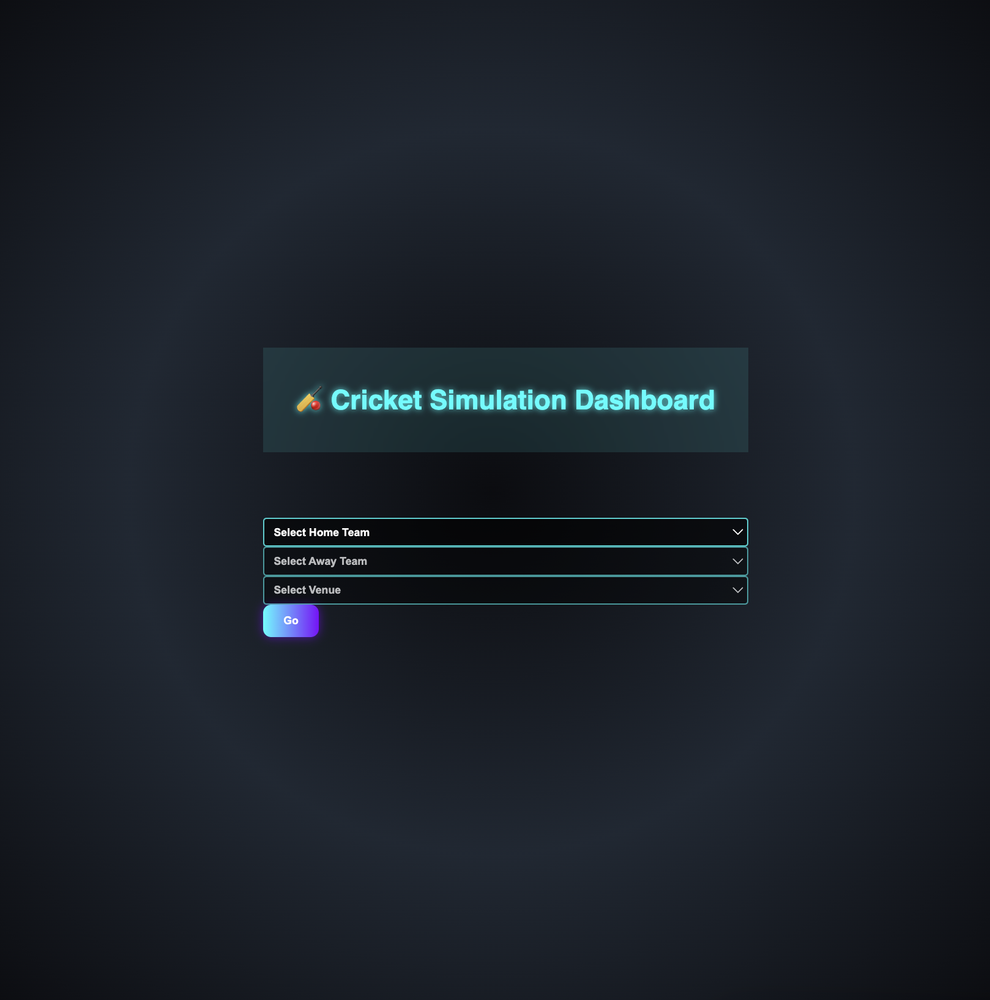
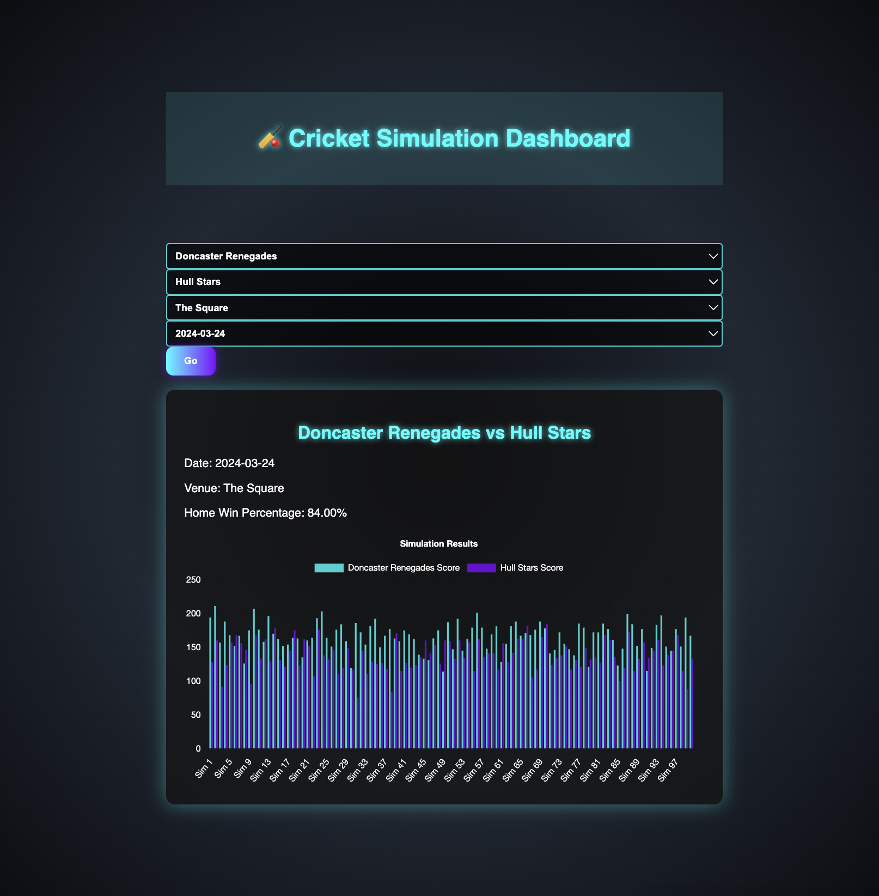

---
### 📌 **Fullstack Cricket Simulation Dashboard** 🏏

A **full-stack** web application that simulates cricket matches and provides interactive visualizations.
---
## 🔑 Login Details

To access the **Cricket Simulation Dashboard**, use the following test credentials:

- **Username**: `test`
- **Password**: `test`

> ⚠️ *These are test credentials and should not be used in production.*

## 📜 **Table of Contents**

* [📌 Features](https://chatgpt.com/c/67a00f57-a2c0-8003-953f-84a960ec4f9c#features)
* [📂 Project Structure](https://chatgpt.com/c/67a00f57-a2c0-8003-953f-84a960ec4f9c#project-structure)
* [🛠 Installation &amp; Setup](https://chatgpt.com/c/67a00f57-a2c0-8003-953f-84a960ec4f9c#installation--setup)
* [🚀 Running the Application](https://chatgpt.com/c/67a00f57-a2c0-8003-953f-84a960ec4f9c#running-the-application)
* [🔗 API Endpoints](https://chatgpt.com/c/67a00f57-a2c0-8003-953f-84a960ec4f9c#api-endpoints)
* [📷 Screenshots](https://chatgpt.com/c/67a00f57-a2c0-8003-953f-84a960ec4f9c#screenshots)
* [💡 Technologies Used](https://chatgpt.com/c/67a00f57-a2c0-8003-953f-84a960ec4f9c#technologies-used)
* [🤝 Contributing](https://chatgpt.com/c/67a00f57-a2c0-8003-953f-84a960ec4f9c#contributing)
* [📝 License](https://chatgpt.com/c/67a00f57-a2c0-8003-953f-84a960ec4f9c#license)

---

## 📌 **Features**

✅ **Simulated Cricket Matches** - Uses predefined data to simulate cricket results.

✅ **Interactive Charts** - Visual representation of simulation runs with  **Chart.js** .

✅ **Game Filtering** - Filter matches based on date, venue, and teams.

✅ **Modern UI** - **Tailwind CSS** for a sleek design with neon highlights.

✅ **REST API** - **FastAPI** backend serves cricket game data.

✅ **Docker Support** - Easily deployable with Docker and `docker-compose`.

---

## 📂 **Project Structure**

```
fullstack-cricket-sim
├── backend/                # FastAPI backend
│   ├── main.py             # Main backend application
│   ├── models.py           # Database models
│   ├── database.py         # Database connection
│   ├── requirements.txt    # Python dependencies
│   ├── data/               # CSV files for game data
│   ├── Dockerfile          # Docker configuration for backend
│   └── test_simulation.py  # Unit tests
│
├── frontend/               # React frontend
│   ├── src/
│   │   ├── components/     # UI components
│   │   │   ├── GameDetails.js
│   │   │   ├── GameSelector.js
│   │   │   ├── GameFilter.js
│   │   ├── App.js          # Main React app
│   │   ├── index.js        # Entry point
│   │   ├── index.css       # Styles (TailwindCSS)
│   ├── package.json        # Frontend dependencies
│   ├── Dockerfile          # Docker configuration for frontend
│   └── public/index.html   # Static HTML template
│
├── docker-compose.yml      # Container orchestration
├── README.md               # Documentation
└── .gitignore              # Ignore unnecessary files
```

---

## 🛠 **Installation & Setup**

### **1️⃣ Clone the Repository**

```bash
git clone https://github.com/yourusername/fullstack-cricket-sim.git
cd fullstack-cricket-sim
```

### **2️⃣ Backend Setup**

Ensure **Python 3.9+** and `pip` are installed.

```bash
cd backend
pip install -r requirements.txt
uvicorn main:app --reload
```

Backend will start at  **`http://localhost:8000`** .

### **3️⃣ Frontend Setup**

Ensure **Node.js** and **npm** are installed.

```bash
cd frontend
npm install
npm start
```

Frontend will start at  **`http://localhost:3000`** .

---

## 🚀 **Running the Application**

### **Using Docker (Recommended)**

```bash
docker-compose up --build
```

This will start **both the backend and frontend** inside Docker containers.

---

## 🔗 **API Endpoints**

| Endpoint          | Method | Description                  |
| ----------------- | ------ | ---------------------------- |
| `/games`        | GET    | Fetch all cricket games      |
| `/games/{id}`   | GET    | Fetch a specific game by ID  |
| `/games/filter` | GET    | Fetch games based on filters |

You can access the interactive API docs at  **`http://localhost:8000/docs`** .

---

## 📷 **Screenshots**

### 🎮 **Game Selector**



### 📊 **Match Statistics**



---

## 💡 **Technologies Used**

### **Backend**

* ⚡ FastAPI (Python)
* 📦 SQLite
* 🔹 SQLAlchemy

### **Frontend**

* ⚛ React.js
* 🎨 Tailwind CSS
* 📊 Chart.js

### **DevOps**

* 🐳 Docker
* ⚙️ Docker-Compose
